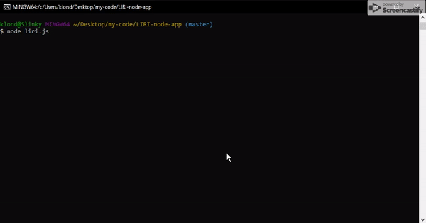

# LIRI-node-app

Language Interpretor and Recogonition Interface

A NPM interpretor for Spotify, Band in Town, and OMDB requests.

## Installing

Once you've cloned the repository, you'll need to install the required node packages listed in packages.json. This is done with a simple npm install command.

After the packages are installed you'll be able to run 'node liri.js'

## Interacting with LIRI

You may either enter in one of the commands as an argument; "concert-this", "spotify-this-song", "movie-this", or "do-what-it-says", or alternatively enter in no arguments for a interactive menu.

For "concert-this", "spotify-this-song", or "movie-this" you'll also need to enter in an artist/band, song title, or movie title to search for.

concert-this will run a search on bandsintown.com and list all the upcoming concerts, with their name, venue location, and the date's listed for the given artist/band.

spotify-this-song will search Spotify for all songs with the given title and list their artist(s), song name, album, and a link to the song preview.

movie-this will search the OMDB and give you information on the movie including it's release year, IMDB rating, country of production, language, a short plot, and the starring actors.

do-what-it-says will read a random.txt file, and run the command stored in the text file.

## Built With
* Javascript
* Node
* Dotenv
* Inquirer
* moment
* node-spotify-api
* request

## Authors

* **Andrew Meyer** - *Initial work* - [Andypants152](https://github.com/Andypants152)